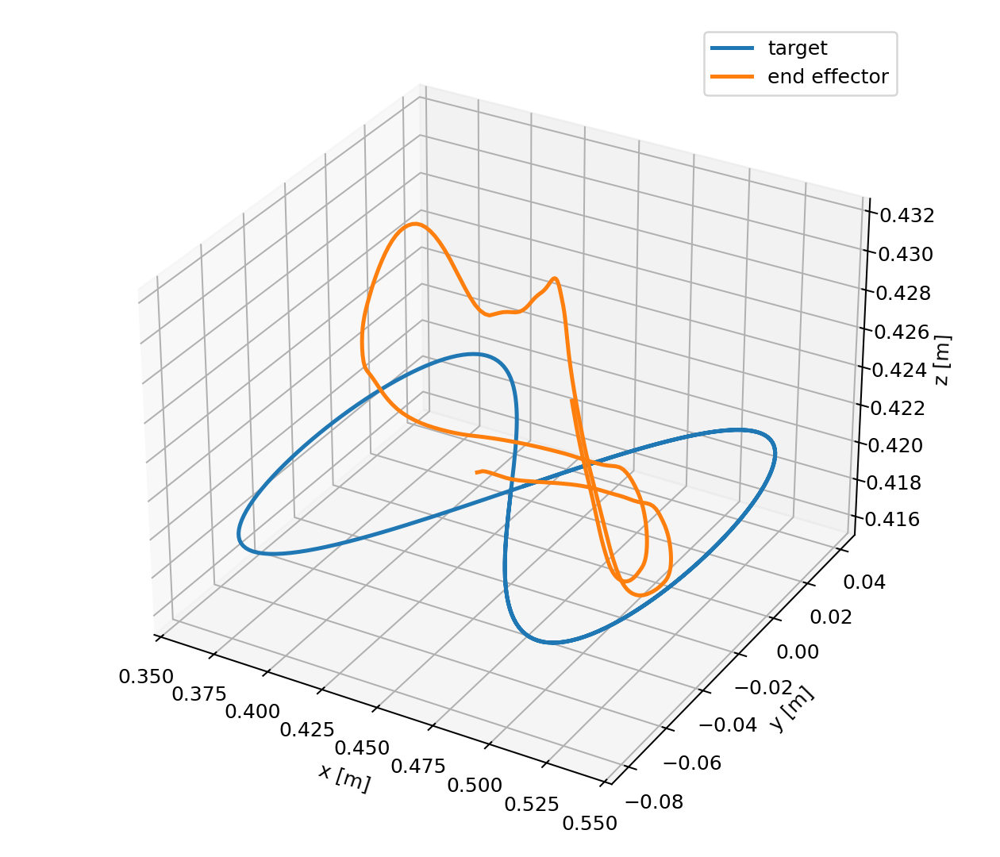
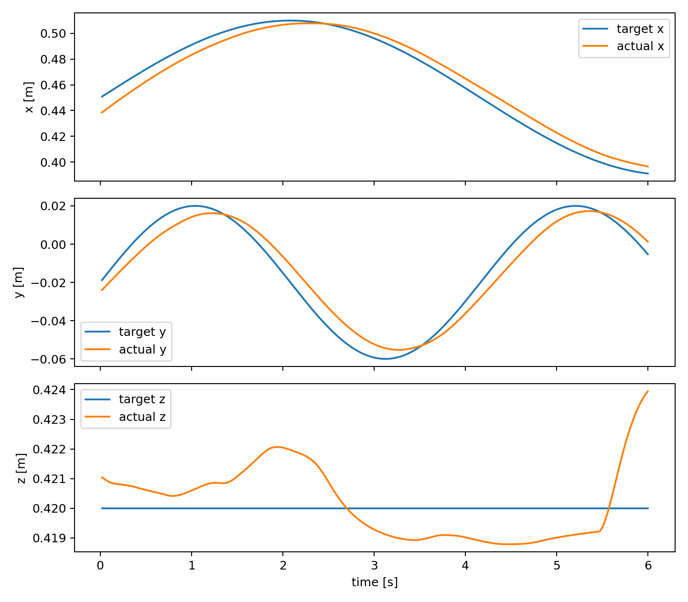
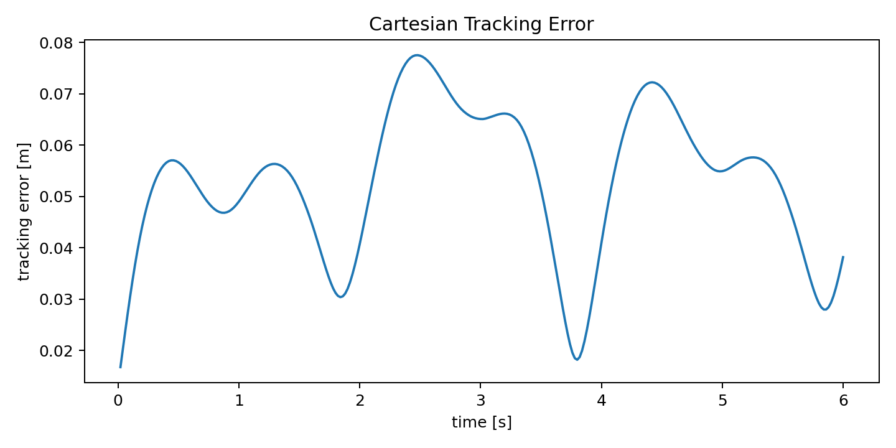
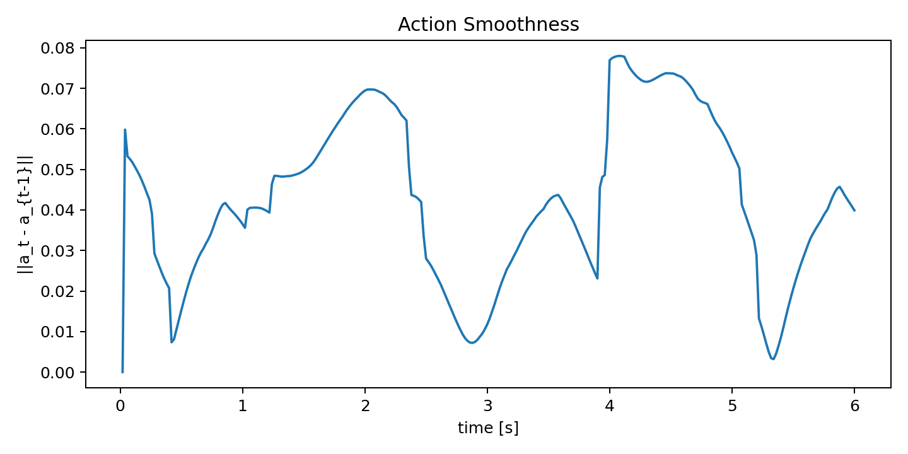

# 3D End-Effector Tracking with Residual Reinforcement Learning

This project trains and evaluates a Franka Panda-style 7-DoF arm in MuJoCo for continuous 3D end-effector trajectory tracking.

## What This Submission Focuses On

This submission is optimized around four criteria:

1. Tracking accuracy over time
2. Smoothness and stability
3. Robustness to noise and delay
4. A simple, interpretable residual-control design

## Method Summary

The controller is intentionally simple:

```text
dq_final = dq_DLS_IK + alpha * filtered(dq_RL)
```

A damped least-squares IK controller handles nominal geometric tracking. SAC from Stable-Baselines3 learns a small residual correction on top of that command. The residual action is bounded and low-pass filtered before it is added to the IK command, which reduces high-frequency jitter.

For fairness in robustness evaluation, action noise and command delay are applied to the final joint-velocity command, not only to the learned residual. This means the IK baseline and residual policy experience the same execution-layer perturbations.

## Features

- MuJoCo Franka Panda-style 7-DoF arm model
- Gymnasium-compatible `FrankaTrackingEnv`
- Circle, figure-eight, and noisy moving-target trajectories
- SAC residual policy with Stable-Baselines3
- Observation noise, action noise, action delay, and occasional unreachable targets
- RMSE, max error, smoothness, and jerk metrics
- Plot generation and mp4 video recording

## Installation

```bash
pip install -r requirements.txt
```

The current implementation was tested with Python 3.12. In the provided environment, Stable-Baselines3 imported a broken TensorBoard/Keras stack, so the project uses a narrow compatibility wrapper that disables TensorBoard imports while keeping SAC intact.

## Quick Start

Check the Gymnasium/SB3 environment contract:

```bash
python scripts/check_env.py
```

Run the IK baseline:

```bash
python evaluate.py --config configs/clean.yaml --controller ik --trajectory figure_eight --output-prefix evaluation_ik_clean_figure_eight
```

Train the SAC residual policy for the default 1,000,000 timesteps:

```bash
python train.py --checkpoint checkpoints/sac_residual_franka.zip --seed 0
```

Evaluate the trained residual policy:

```bash
python evaluate.py --config configs/clean.yaml --controller policy --checkpoint checkpoints/sac_residual_franka.zip --trajectory figure_eight --output-prefix evaluation_policy_clean
```

Run the robustness ablation table:

```bash
python scripts/run_ablation.py --checkpoint checkpoints/sac_residual_franka.zip --trajectory figure_eight
```

Generate a video:

```bash
python record_video.py --config configs/clean.yaml --controller policy --checkpoint checkpoints/sac_residual_franka.zip --trajectory figure_eight --output results/videos/franka_tracking.mp4 --render-mode plot --width 480 --height 368
```

Use `--render-mode auto` on a machine with a working MuJoCo OpenGL context. The `plot` mode is a headless fallback for CI/sandboxed machines.

## State, Action, Reward

Observation, 38D:

```text
q, dq, ee_pos, ee_vel, target_pos, target_vel, target_pos - ee_pos, previous_action, sin(phase), cos(phase)
```

Action, 7D:

```text
bounded residual joint velocity in [-1, 1]
```

The residual is filtered before application:

```text
u_filtered[t] = beta * u_filtered[t-1] + (1 - beta) * u_raw[t]
```

The DLS IK target also uses a short lookahead:

```text
x_ik = x_target + lookahead * v_target
```

Reward:

```text
r = - w_pos ||x_ee - x_target||^2
    - w_vel ||v_ee - v_target||^2
    - w_action ||a_t||^2
    - w_smooth ||a_t - a_{t-1}||^2
    - w_jerk ||a_t - 2a_{t-1} + a_{t-2}||^2
    - w_joint joint_limit_penalty
```

The reward prioritizes Cartesian tracking accuracy while penalizing high-frequency action changes to encourage smooth, hardware-friendly motion.

## Trajectories

Circle:

```text
x = x0 + r cos(wt)
y = y0 + r sin(wt)
z = z0
```

Figure-eight:

```text
x = x0 + A sin(wt)
y = y0 + B sin(2wt)
z = z0
```

The noisy target mode adds Gaussian perturbations to the clean figure-eight target.

## Evaluation Protocol

The main evaluation separates perturbations instead of stacking every uncertainty source at once:

- Clean figure-eight tracking
- Action noise applied to the final command
- One-step command delay applied to the final command
- Trajectory mismatch using a slightly larger and faster figure-eight
- Mild combined action noise + command delay

Each setting is evaluated with both the IK baseline and the trained Residual SAC policy. Observation noise and unreachable targets are kept as separate stress tests rather than main claims, because observation noise affects the learned policy input but not the analytic IK baseline in the same way.

## Results

Results below are from `scripts/run_ablation.py` using the trained SAC residual checkpoint:

| Setting | Controller | RMSE ↓ | Mean Error ↓ | Max Error ↓ | Smoothness ↓ | Jerk ↓ |
|---|---|---:|---:|---:|---:|---:|
| Clean | IK | 0.0076 | 0.0073 | 0.0135 | 0.0007 | 0.0000 |
| Clean | Residual SAC | 0.0098 | 0.0095 | 0.0135 | 0.0007 | 0.0000 |
| Action noise | IK | 0.0076 | 0.0073 | 0.0135 | 0.0008 | 0.0004 |
| Action noise | Residual SAC | 0.0098 | 0.0095 | 0.0135 | 0.0008 | 0.0004 |
| Command delay | IK | 0.0078 | 0.0074 | 0.0148 | 0.0178 | 0.0164 |
| Command delay | Residual SAC | 0.0100 | 0.0097 | 0.0148 | 0.0174 | 0.0163 |
| Trajectory mismatch | IK | 0.0131 | 0.0124 | 0.0193 | 0.0021 | 0.0000 |
| Trajectory mismatch | Residual SAC | 0.0156 | 0.0149 | 0.0231 | 0.0020 | 0.0000 |
| Mild combined | IK | 0.0078 | 0.0074 | 0.0148 | 0.0179 | 0.0167 |
| Mild combined | Residual SAC | 0.0100 | 0.0097 | 0.0148 | 0.0175 | 0.0167 |

The fair paired ablation shows that the IK baseline remains slightly stronger on RMSE for this simplified low-speed geometric tracking task. The Residual SAC policy achieves comparable centimeter-level tracking while keeping similar smoothness, with slightly lower smoothness cost than IK in the command-delay and mild-combined settings.

Generated outputs:

- `results/plots/3d_trajectory.png`
- `results/plots/xyz_tracking.png`
- `results/plots/tracking_error.png`
- `results/plots/action_smoothness.png`
- `results/videos/franka_tracking.mp4`

### Visual Results

[](results/videos/franka_tracking.mp4)




## Design Notes

Residual RL is used because pure joint-space RL is slow and can produce unsafe exploratory motion. The IK controller handles the obvious geometry, while SAC learns bounded corrections for tracking dynamics, delay, noise, and model mismatch.

The MuJoCo model uses a simplified Panda-style MJCF with seven revolute joints and Panda-like joint limits. The default simulation uses zero gravity to approximate a low-level gravity-compensated joint position controller, which is a common assumption when training higher-level joint velocity policies.

## Limitations

The IK baseline is already strong on clean geometric tracking, so the residual policy provides limited RMSE improvement in the current version. The value of the RL component here is mainly in the residual-control structure: learned corrections are bounded, filtered, and evaluated under transparent perturbation ablations.
